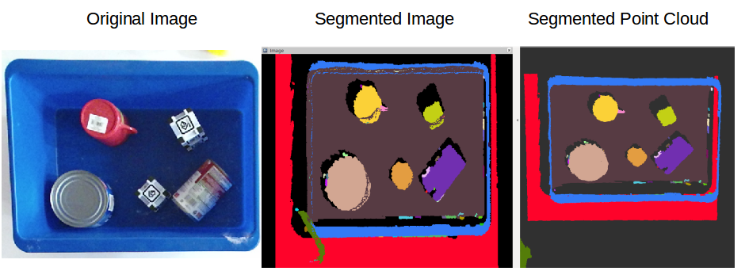

# Simple Object Segmentation
ROS Node for segmenting unknown objects using simple geometrical heuristics. 
The node takes point cloud data from RGB--D sensor or stereo camera as input.

This repository is for the Kinect V2 sensor and inputs a point cloud and outputs
via ROS nodes a segmented point cloud and an image representation of this 
segmented point cloud, projected on the xy plane. 

Note that we crop part of the point cloud to run our segmentation on since we're
only interested in a small part of the image. 

This repository is based largely on the following repository:
https://github.com/iKrishneel/simple_object_segmentation

## Requirements
- [ROS](http://wiki.ros.org/indigo) >= indigo
- [PCL](https://github.com/PointCloudLibrary/pcl) >= 1.7
- [OpenCV](https://github.com/opencv/opencv)

## Compilation

```bash
git clone https://github.com/DoKu88/kinect_segmentation.git
catkin build simple_object_segmentation
source $HOME/.bashrc
```

## Running
to run fully automatic segmentation
```bash
roslaunch simple_object_segmentation simple_object_segmentation.launch
```
### options
[**DEFAULT**] setting is none, whereby whole scene is segmented 
* [jsk_recognition](https://github.com/jsk-ros-pkg/jsk_recognition) *is required for visualization*
```bash
roslaunch simple_object_segmentation simple_object_segmentation.launch user_input:=none
```

### Parameters
The user control parameters are defined in `./cfg/SupervoxelSegmentation.cfg`. The pameters are for controlling the supervoxel segmentation. The details and functions of the parameters can be found in the [pcl tutorial page.](http://pointclouds.org/documentation/tutorials/supervoxel_clustering.php)


## Sample Results

